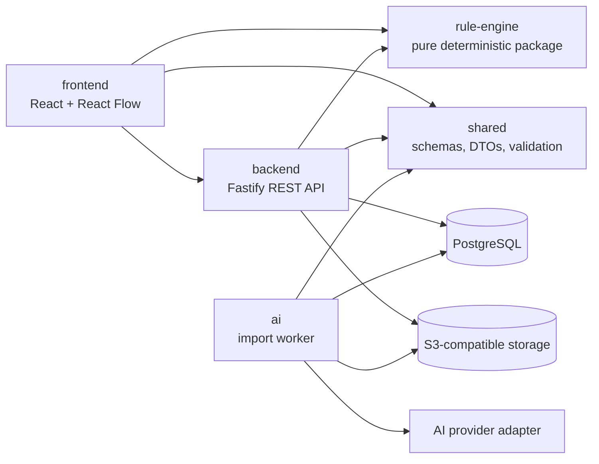

# Implementation Plan V1
## Hardware System Designer

**Status:** Executable implementation baseline  
**Scope:** V1 only  
**Last updated:** 2026-10-07  
**Implementation state:** Not started

---

## 1. Purpose

This document converts the approved V1 engineering, schema, database, and UI/UX specifications into an ordered implementation program. It defines the technical baseline, module boundaries, work packages, dependencies, verification gates, and release criteria required before V1 may be declared complete.

This document does not change product or engineering behavior. If an implementation decision conflicts with a normative V1 specification, the specification wins and the conflict must be resolved through an explicit specification amendment or architecture decision record (ADR).

The plan is executable when each work package can be created as an issue with its listed inputs, outputs, dependencies, tests, and exit criteria.

---

## 2. Authoritative Inputs

Implementation shall trace to these baselines:

1. `docs/specifications/engineering-specification-v1.md`
2. `docs/specifications/component-schema-v1.md`
3. `docs/schemas/component-schema-v1.schema.json`
4. `docs/specifications/port-interface-schema-v1.md`
5. `docs/schemas/port-interface-schema-v1.schema.json`
6. `docs/specifications/connection-rule-specification-v1.md`
7. `docs/schemas/connection-rule-result-v1.schema.json`
8. `docs/specifications/project-file-specification-v1.md`
9. `docs/schemas/project-file-v1.schema.json`
10. `docs/specifications/database-schema-v1.md`
11. `database/migrations/0001_initial_schema.sql`
12. `docs/ui-ux/screen-flow-v1.md`

Normative priority is:

```text
Engineering Specification
        -> specialized specification
        -> machine-readable schema
        -> database migration
        -> UI/UX flow
        -> this implementation plan
        -> implementation
```

Any discovered disagreement is recorded before implementation proceeds. Code must not silently choose one interpretation.

---

## 3. Delivery Assumptions

- V1 is a browser-based, single-organization application with `USER` and `ADMIN` roles.
- V1 supports one active editor per project, while still protecting against multiple tabs, retries, and delayed autosaves.
- English is the canonical engineering-message language. UI localization may be added without changing stable rule codes.
- Modern evergreen desktop browsers are the primary editor target. Narrow screens may inspect data but are not required to provide a full canvas-authoring experience.
- PostgreSQL is the system of record. Component and project JSON documents remain the portable engineering source of truth.
- Datasheet files use S3-compatible object storage and are never stored directly in PostgreSQL.
- AI extracts candidates only. It never verifies components and never decides connection validity.
- The deterministic rule engine owns all engineering decisions.
- Exact dependency versions are locked in the first implementation commit and updated only through reviewed dependency changes.

---

## 4. Locked Technical Baseline

| Concern | V1 decision |
|---|---|
| Repository | TypeScript monorepo using pnpm workspaces |
| Runtime | Node.js 24 LTS |
| Language | TypeScript with `strict` enabled and no unchecked cross-package imports |
| Frontend | React 19, Vite, and `@xyflow/react` for the diagram canvas |
| UI state | TanStack Query for server state; a dedicated editor store for transient canvas and dirty-state management |
| Forms | Schema-aware form controls; Ajv validation is authoritative at submit boundaries |
| Styling | CSS custom properties plus locally scoped component styles; semantic HTML is preferred |
| Backend | Fastify 5 with versioned REST endpoints under `/api/v1` |
| API contract | JSON request/response schemas, generated OpenAPI output, and one stable application error envelope |
| Schema validation | Ajv 2020 in strict mode with an explicit registry for all local `$ref` values |
| Database | PostgreSQL 16 compatibility baseline, SQL-first migrations, and parameterized `pg` repository adapters |
| Authentication | Email/password, Argon2id hashes, server-side sessions, secure `HttpOnly` cookies, and role checks |
| Object storage | S3-compatible API; local development may use MinIO |
| Background jobs | PostgreSQL-backed datasheet import queue with leasing, bounded retry, and idempotent handlers |
| Unit/contract tests | Vitest |
| Database integration | Disposable PostgreSQL instance with migrations applied from zero |
| Browser tests | Playwright, initially Chromium; Firefox added to release smoke tests |
| Logging | Structured JSON logs with request, user, project, import-job, and correlation identifiers where applicable |
| Packaging | Container images for frontend, API, and worker; database and object storage remain external services |

### 4.1 Version Policy

Major-version choices above are architecture decisions. The bootstrap work package selects exact compatible versions, writes them to the lockfile, and records runtime requirements. Dependency upgrades shall not be combined with feature work after the baseline is locked.

### 4.2 Deliberately Deferred Choices

The following choices are not required to begin core implementation:

- Cloud or on-premise deployment provider.
- Production S3-compatible vendor.
- AI provider and model.
- Transactional email provider.
- Full telemetry backend.

Each deferred choice is hidden behind an adapter and has a decision deadline in Section 15.

---

## 5. Target Architecture



### 5.1 Dependency Rules

1. `shared` contains versioned schemas, schema loading, identifiers, DTOs, and non-domain utilities. It depends on no application package.
2. `rule-engine` depends only on `shared`. It performs no network, database, filesystem, clock, random, UI, or AI operation.
3. `backend` may depend on `shared` and `rule-engine` but not on `frontend` or concrete AI-provider code.
4. `frontend` may depend on browser-safe exports from `shared` and `rule-engine` but not on backend internals.
5. `ai` depends on `shared` and persistence/object-storage ports. It may not publish a component without the same publication service and validators used by the backend.
6. `database` owns migrations and database fixtures. Application packages do not create schema implicitly at runtime.
7. `tests` owns cross-process integration and end-to-end suites; package-local tests stay beside their owning package.
8. Circular package dependencies fail CI.

### 5.2 Runtime Processes

V1 has three deployable processes:

- `web`: static frontend assets.
- `api`: authentication, library, project, rule-evaluation, import, and admin HTTP endpoints.
- `worker`: leased datasheet jobs, text extraction, AI calls, candidate normalization, and candidate persistence.

The worker can run from the same image as the API with a different entry point, but it is a separate process and failure domain.

---

## 6. Source-of-Truth and Contract Strategy

### 6.1 Schemas

The four V1 JSON Schemas are source artifacts, not generated build output. TypeScript types may be derived from them, but generated types are never edited manually.

The shared schema registry shall:

- use JSON Schema Draft 2020-12;
- register schemas by exact `$id`;
- resolve local cross-schema references without network access;
- reject unknown formats and unsupported schema or ruleset versions;
- expose separate structural and semantic validation results;
- produce stable, sanitized validation paths for API and UI use.

### 6.2 API

The API uses `/api/v1`. All non-success responses use one envelope containing:

- stable application `code`;
- human-readable `message`;
- request/correlation ID;
- optional field or JSON Pointer errors;
- optional structured engineering result where appropriate.

Expected transport outcomes are consistent across modules:

- `400`: malformed request or unsupported representation;
- `401`: unauthenticated;
- `403`: authenticated but unauthorized;
- `404`: resource unavailable without leaking another user's resource existence;
- `409`: revision, identity, or lifecycle conflict;
- `413`: upload/import exceeds configured limit;
- `422`: schema-valid transport with invalid domain or engineering content;
- `500`: internal failure with sanitized client response.

### 6.3 Project Mutation Path

All engineering mutations use this path:

```text
UI command
  -> optional browser preview using the shared rule engine
  -> API command with expected document revision
  -> authorization and schema/semantic validation
  -> server-side rule re-evaluation
  -> transactional compare-and-swap save
  -> committed document revision returned to the UI
```

The browser result improves responsiveness but never authorizes persistence. The server result is authoritative.

### 6.4 Identifiers and Time

- New entity IDs use the existing entity prefix plus uppercase monotonic ULID text.
- IDs are generated by the trusted process that owns entity creation.
- Stored timestamps are UTC RFC 3339 values; display formatting uses the user's locale.
- Tests inject clock and ID providers rather than weakening deterministic domain code.

---

## 7. Initial API Surface

The route inventory below is a planning contract. Request and response detail is finalized during contract-foundation work before handler implementation.

| Area | Required V1 operations |
|---|---|
| Session | login, logout, current session |
| Components | list/search/filter, retrieve revision, create manual draft, publish user revision, compare revisions |
| Datasheets | upload, retrieve metadata/download authorization, create import job, read job/candidates, select/reject candidate |
| Projects | list, create, retrieve, rename, soft delete, save with expected revision, import as copy, export |
| Engineering | connection preview, connection commit, full Design Check |
| Admin | review queue, review detail, request changes, verify, deprecate, disable |
| Operations | health, readiness, build/version information |

Long-running import status uses bounded HTTP polling in V1. WebSocket or server-sent-event infrastructure is not required.

---

## 8. Persistence Additions Required Before Their Features

Migration `database/migrations/0001_initial_schema.sql` remains the approved V1 domain baseline. Subsequent additive migrations are expected:

| Migration need | Required before | Minimum content |
|---|---|---|
| Authentication sessions | Session milestone | hashed session token, user reference, expiry, revocation, creation/use timestamps |
| Import-job leasing | AI milestone | attempt count, lease owner, lease expiry, next-attempt time, sanitized terminal failure metadata |
| Optional password operations | Account recovery, only if retained in V1 | one-time token digest, expiry, consumed timestamp |

Every migration shall include a forward migration test from an empty database and from the immediately previous migration. Production migrations are forward-only; rollback is performed through restore or a reviewed compensating migration.

---

## 9. Work Breakdown and Execution Order

Work package IDs are stable planning references. A package is complete only when its exit gate passes.

### M0 — Architecture Closure and Repository Bootstrap

**Goal:** produce a reproducible development baseline and a walking skeleton.

| ID | Work package | Depends on | Required output |
|---|---|---|---|
| `M0-01` | Record architecture decisions | This plan | ADRs for stack/runtime, package boundaries, auth/session, storage/queue, and schema source-of-truth |
| `M0-02` | Bootstrap workspace | `M0-01` | root workspace config, pinned toolchain, shared lint/format/type-check settings, lockfile |
| `M0-03` | Local infrastructure | `M0-01` | reproducible PostgreSQL and S3-compatible local services, documented environment variables |
| `M0-04` | API and web skeleton | `M0-02` | frontend shell, API health/readiness endpoints, worker entry point |
| `M0-05` | CI baseline | `M0-02` | install, formatting check, lint, type check, unit test, schema test, build, migration smoke test |

**Exit gate:** a clean checkout can install, start required local services, apply migrations, build all packages, serve the web shell, answer API readiness, and pass CI using documented commands.

### M1 — Contract and Validation Foundation

**Goal:** make all existing V1 schemas executable and prevent contract drift.

| ID | Work package | Depends on | Required output |
|---|---|---|---|
| `M1-01` | Schema registry | `M0` | Ajv 2020 registry with all four schemas and offline `$ref` resolution |
| `M1-02` | Derived types | `M1-01` | reproducible generated types plus drift check in CI |
| `M1-03` | Canonical fixtures | `M1-01` | minimal and representative valid fixtures and invalid boundary fixtures |
| `M1-04` | Semantic validators | `M1-01` | component and project reference/uniqueness/version validation independent of I/O |
| `M1-05` | HTTP conventions | `M0-04` | error envelope, request IDs, versioned route conventions, OpenAPI generation |

**Exit gate:** every canonical fixture validates identically in Node and the browser; every invalid fixture fails with the expected stable code/path; generated artifacts are reproducible.

### M2 — Identity, Authorization, and Application Shell

**Goal:** establish secure role-aware access before business data endpoints expand.

| ID | Work package | Depends on | Required output |
|---|---|---|---|
| `M2-01` | Session migration and repository | `M0-03` | additive session migration and expiry/revocation queries |
| `M2-02` | Authentication service | `M2-01`, `M1-05` | Argon2id verification, login/logout/current-session endpoints, rate limits |
| `M2-03` | Authorization policies | `M2-02` | reusable `USER`, owner, and `ADMIN` guards with negative tests |
| `M2-04` | Frontend shell | `M2-02` | login flow, authenticated shell, role-aware navigation, global error boundaries |

**Exit gate:** active users can sign in/out; disabled users cannot sign in; users cannot infer or mutate another user's project; admin-only routes fail closed.

### M3 — Component Library and Manual Authoring

**Goal:** deliver the component lifecycle without depending on AI.

| ID | Work package | Depends on | Required output |
|---|---|---|---|
| `M3-01` | Component read model | `M1`, `M2` | searchable/filterable library and immutable revision retrieval |
| `M3-02` | Manual component workflow | `M3-01` | create/revise/submit services using Component and Port validators |
| `M3-03` | Publication transaction | `M3-02` | atomic revision insert, projection update, datasheet links, review action, audit event |
| `M3-04` | Library UI | `M3-01` | list, filters, detail, revision/provenance display |
| `M3-05` | Component form UI | `M3-02` | identity, ports, pins, resources, power, addresses, notes, and validation summary |
| `M3-06` | Admin review workflow | `M3-03` | queue, comparison workspace, request changes, verify, deprecate, disable |

**Exit gate:** a user can author and submit a structurally and semantically valid component; an admin can verify it as a new immutable revision; audit and review history are complete.

### M4 — Project Lifecycle and Persistence

**Goal:** persist, recover, import, and export canonical project documents before advanced editing.

| ID | Work package | Depends on | Required output |
|---|---|---|---|
| `M4-01` | Project repository | `M1`, `M2` | owner-scoped CRUD, soft delete, compare-and-swap save |
| `M4-02` | Project command service | `M4-01` | atomic schema/semantic validation and document/engineering revision rules |
| `M4-03` | Dashboard UI | `M4-01` | recent/list/search/new/rename/delete flows with empty/loading/error states |
| `M4-04` | Export and import | `M4-02` | strict UTF-8 export and fail-closed Create Copy import pipeline |
| `M4-05` | Autosave and recovery | `M4-02` | three-second idle autosave, no-op suppression, local recovery cache, conflict UI |

**Exit gate:** a project round-trips through save, export, Create Copy import, browser recovery, and re-save without losing canonical engineering state; stale writes produce an explicit conflict and never overwrite newer data.

### M5 — Deterministic Rule Engine

**Goal:** implement the complete ruleset independently from UI and persistence.

| ID | Work package | Depends on | Required output |
|---|---|---|---|
| `M5-01` | Engine kernel | `M1` | evaluation context, phase pipeline, registry, stable sorting, fingerprints, aggregation |
| `M5-02` | Structural/interface rules | `M5-01` | `STRUCT-*` and `IFACE-*` catalog implementations |
| `M5-03` | Electrical/allocation rules | `M5-01` | `ELEC-*` and `ALLOC-*` implementations with allocation effects |
| `M5-04` | Bus rules | `M5-02`, `M5-03` | `BUS-*` behavior for I2C, SPI, 1-Wire, RS-485/Modbus, CAN, and LIN boundaries |
| `M5-05` | Power/completeness rules | `M5-01` | `POWER-*` and `COMP-*` implementations |
| `M5-06` | Evaluation modes | `M5-02..05` | preview, commit, full Design Check, override handling, stale-result behavior |
| `M5-07` | Conformance corpus | `M5-02..06` | table, boundary, golden, property, determinism, and incremental/full-equivalence tests |

**Exit gate:** every required rule ID has positive, negative, and boundary coverage; repeated inputs are byte-stable after canonical serialization; browser and server produce identical result documents; no AI or I/O dependency exists.

### M6 — Engineering Editor and Connection Vertical Slice

**Goal:** combine project persistence and the rule engine into the primary V1 workflow.

| ID | Work package | Depends on | Required output |
|---|---|---|---|
| `M6-01` | Editor state model | `M4`, `M5` | command-based editor store, selections, undo/redo, dirty revisions, derived indexes |
| `M6-02` | Canvas shell | `M6-01` | component nodes, ports, pan/zoom, selection, layout persistence, keyboard basics |
| `M6-03` | Add component | `M3`, `M6-02` | searchable insertion using immutable component snapshots |
| `M6-04` | Connection preview | `M5`, `M6-02` | endpoint selection, setup panel, live valid/warning/error result presentation |
| `M6-05` | Atomic connection commit | `M4-02`, `M6-04` | server re-evaluation, warning confirmation, allocations, revision compare-and-swap |
| `M6-06` | Bus and power UX | `M6-05` | bus membership, addresses/chip select, power flow/current margin, visual states |
| `M6-07` | Inspector and resources | `M6-03..06` | component/connection inspector, pin/resource allocation, notes, provenance |
| `M6-08` | Design Check | `M6-05` | full run, summary, issue navigation, persisted history, staleness indication |
| `M6-09` | Component update | `M3`, `M6-08` | compare revision, impact preview, explicit snapshot replacement, revalidation |

**Exit gate:** the MCU-to-sensor, I2C shared-bus, incompatible-interface, power-overload, warning-override, and component-update acceptance journeys pass end to end.

### M7 — Datasheet and AI Candidate Pipeline

**Goal:** turn an untrusted PDF into reviewable candidates without granting engineering authority to AI.

| ID | Work package | Depends on | Required output |
|---|---|---|---|
| `M7-01` | Secure upload | `M2`, `M3` | PDF signature/media/size/page checks, digest deduplication, authorized object access |
| `M7-02` | Leased job queue | `M7-01` | additive lease migration, claim/heartbeat/retry/failure/recovery behavior |
| `M7-03` | Extraction pipeline | `M7-02` | bounded PDF text extraction, multi-candidate detection, provider-neutral input |
| `M7-04` | AI provider adapter | `M7-03`, decision gate `D3` | structured candidate response, timeout/retry/token limits, recorded model ID |
| `M7-05` | Candidate normalization | `M7-04`, `M1` | provenance/confidence mapping and validation without silent value invention |
| `M7-06` | Review UI | `M7-05`, `M3-05` | progress polling, candidate choice, field review, correction, rejection, submission |

**Exit gate:** fixture PDFs produce reviewable candidates, multiple candidates remain distinct, every extracted claim retains source/provenance where available, invalid output cannot be published, and provider failure never corrupts existing library data.

### M8 — Hardening and V1 Release

**Goal:** prove V1 is safe, operable, accessible, and recoverable.

| ID | Work package | Depends on | Required output |
|---|---|---|---|
| `M8-01` | Security hardening | `M2..M7` | upload/import abuse limits, CSRF/session review, authorization matrix, dependency scan |
| `M8-02` | Performance budgets | `M6`, `M7` | measured project-size limits, editor/rule/API budgets, query evidence for new indexes |
| `M8-03` | Accessibility verification | `M3`, `M6`, `M7` | keyboard paths, focus management, labels, non-color status, screen-reader smoke tests |
| `M8-04` | Operations | `M0..M7` | backups/restores, migration runbook, health/readiness, logs, alertable failure states |
| `M8-05` | Release regression | all | clean-environment installation and complete V1 acceptance suite |

**Exit gate:** all specification acceptance criteria are traceable to passing tests or an approved manual verification record; no open severity-one defect or data-loss defect remains.

---

## 10. Recommended Parallel Workstreams

After `M1` and `M2` establish contracts and authorization, work may proceed in three coordinated streams:

| Stream | Primary packages | Sequence |
|---|---|---|
| Domain | `shared`, `rule-engine` | `M1 -> M5 -> M6 integration` |
| Platform | `backend`, `database`, `ai` | `M2 -> M3/M4 -> M7` |
| Experience | `frontend`, `tests` | `M2 shell -> M3/M4 UI -> M6 -> M7 UI` |

Synchronization points are:

1. Schema registry and API/error conventions before feature endpoints.
2. Component read contracts before library and editor insertion UI.
3. Project mutation contract before autosave or connection commit.
4. Rule-engine result contract before connection and Design Check UI.
5. Candidate contract before AI provider integration or review UI.

No stream may create a private alternative representation at a synchronization point.

---

## 11. Test Strategy and Quality Gates

### 11.1 Test Layers

| Layer | Primary purpose | Required examples |
|---|---|---|
| Schema | structural contract | canonical valid/invalid component, port, rule result, and project fixtures |
| Unit | pure behavior | rule functions, semantic validators, IDs, canonical hashing, editor commands |
| Golden | stable engineering output | rule IDs, severities, normalized details, ordering, fingerprints |
| Property | invariant exploration | determinism, endpoint permutation rules, round-trip serialization, allocation uniqueness |
| Repository integration | database contract | migration from zero, constraints, triggers, transactions, concurrency, tenant isolation |
| API integration | transport/application boundary | auth matrix, validation mapping, status codes, idempotent retry behavior |
| Browser component | interaction behavior | forms, focus, error states, canvas node/edge controls |
| End to end | user outcomes | specification and screen-flow acceptance journeys |

### 11.2 Pull Request Gate

Every implementation pull request must pass:

1. Formatting and lint checks.
2. Type checking for all affected packages.
3. Schema and generated-artifact drift checks.
4. Affected unit and contract tests.
5. Database migration/integration tests when persistence changes.
6. Production builds for affected deployables.
7. Targeted browser tests when user-visible flows change.

### 11.3 Main and Release Gates

- Main runs all unit, contract, integration, and Chromium end-to-end suites.
- Release runs from an empty database, applies every migration, seeds controlled fixtures, and runs Chromium plus Firefox smoke journeys.
- Tests never call a billable AI provider by default. Provider contract tests use recorded, redacted fixtures; a separately authorized smoke test may call the selected provider.
- Flaky tests are treated as failures and must be fixed or quarantined with an owner and expiry date.

---

## 12. Acceptance Journey Matrix

| Journey | Main specifications | Delivery milestone |
|---|---|---|
| Login and role-aware navigation | Engineering, UI/UX | `M2` |
| Manual component to verified library revision | Component, Port, Database, UI/UX | `M3` |
| Project create/save/autosave/conflict/recovery | Project File, Database, UI/UX | `M4` |
| Export and Create Copy import round trip | Project File, UI/UX | `M4` |
| Deterministic preview/commit/Design Check equivalence | Connection Rule, result schema | `M5` |
| Add MCU and sensor, connect, allocate, save, reload | all core schemas, UI/UX | `M6` |
| Shared I2C bus with address conflict correction | Connection Rule, Project File | `M6` |
| UART-TTL to RS-485 blocked until converter exists | Engineering, Connection Rule | `M6` |
| Power overload and low-margin behavior | Engineering, Connection Rule | `M6` |
| Warning confirmation and audit preservation | Connection Rule, Database | `M6` |
| Component update preview and snapshot replacement | Component, Project File, UI/UX | `M6` |
| PDF to reviewed multi-candidate component submission | Engineering, Component, Database, UI/UX | `M7` |
| Admin verification, deprecation, and disable behavior | Engineering, Database, UI/UX | `M3` and `M8` |

---

## 13. Definition of Ready

A work package may enter implementation only when:

- its normative specification sections are linked;
- dependencies and API/schema inputs are available;
- acceptance cases include success, empty, validation, authorization, conflict, and internal-failure behavior where relevant;
- migrations and compatibility impact are identified;
- security and privacy impact is recorded;
- product wording or design details needed for the package are resolved;
- the package is small enough to review without combining unrelated infrastructure or dependency upgrades.

---

## 14. Definition of Done

A work package is done only when:

- implementation respects module boundaries and contains no duplicated domain rule;
- tests required by its exit gate pass;
- authorization is tested at the server boundary;
- stored JSON passes structural and semantic validation;
- errors are observable and client messages are sanitized;
- keyboard and non-color states are covered for user-visible behavior;
- migrations, configuration, and operations notes are updated where applicable;
- API/OpenAPI and generated artifacts show no drift;
- specification acceptance criteria are linked to automated or documented manual evidence;
- no unresolved critical or high-severity defect remains in the delivered scope.

---

## 15. Decision Gates

| Gate | Deadline | Decision/evidence required | Blocks |
|---|---|---|---|
| `D0` Toolchain compatibility | End of `M0-02` | exact Node, pnpm, TypeScript, Vite, React, Fastify, Ajv, and test versions proven together | all feature code |
| `D1` Session threat model | Before `M2-01` | cookie policy, expiry, revocation, CSRF strategy, login rate limits | authentication |
| `D2` Editor performance envelope | Closed by ADR 0007 | supported project-size fixture and interaction/rule latency budgets | editor architecture |
| `D3` AI provider/model | Before `M7-04` | data handling, regional/privacy constraints, structured-output capability, cost/latency ceiling, evaluation score | live AI integration |
| `D4` Production hosting | Before `M8-04` | runtime, database, object storage, secrets, backup, ingress/TLS, monitoring ownership | release |

Only `D0` is required before the first implementation commit. Deferred gates do not justify speculative provider-specific code.

---

## 16. Risk Register

| Risk | Effect | Mitigation and proof |
|---|---|---|
| Schema/type drift | invalid data crosses package boundaries | schema-first types, fixture suite, drift check in CI |
| Browser/server rule divergence | preview permits a commit the server rejects unexpectedly | same pure package, cross-runtime golden corpus, server re-evaluation |
| Rule interaction complexity | incomplete or order-dependent findings | phase pipeline, immutable registry, property tests, full/incremental equivalence |
| Large project JSONB writes | slow autosave and contention | measured envelope, no-op suppression, debouncing, CAS, query/size telemetry |
| Multiple-tab save race | silent user data loss | expected revision, explicit conflict/recovery flow, concurrency integration tests |
| Canvas library model leakage | persisted project becomes tied to UI library shape | adapter maps canvas objects to canonical Project File fields only |
| AI hallucination | false engineering facts enter library | provenance/confidence, human review, schema/semantic validation, no AI verification |
| Poisoned or oversized files | resource exhaustion or unsafe rendering | signature/size/page/depth limits, isolated parsing, escaped content, no automatic URL fetch |
| Background job duplication | duplicate calls or publications | leases, idempotency key, attempt tracking, atomic publication transaction |
| Incomplete authorization | cross-user data exposure | centralized policies and an endpoint-by-role/ownership negative test matrix |
| Accessibility regression in canvas | core workflow unusable without pointer/color | keyboard command path, focus model, text status, release smoke audit |
| Unreviewed dependency change | unstable build or production behavior | exact lockfile, isolated upgrade changes, build/test matrix |

---

## 17. Planning Estimate

The following is an engineering estimate, not a delivery commitment. It assumes the specifications remain stable, one frontend engineer, one backend/platform engineer, one domain/full-stack engineer, and shared QA/design support.

| Milestone | Indicative effort | Critical dependency |
|---|---:|---|
| `M0` | 1–2 person-weeks | architecture closure |
| `M1` | 2–3 person-weeks | schema interoperability |
| `M2` | 2–3 person-weeks | session threat model |
| `M3` | 4–6 person-weeks | complex component form and lifecycle |
| `M4` | 4–5 person-weeks | project concurrency/import safety |
| `M5` | 7–10 person-weeks | full engineering rule catalog |
| `M6` | 8–11 person-weeks | editor and rule integration |
| `M7` | 5–7 person-weeks | provider choice and extraction quality |
| `M8` | 3–5 person-weeks | whole-system regression |

Total planning envelope is approximately **36–52 person-weeks**, including integration but excluding organizational approval delays. With the three assumed implementation streams, the expected calendar envelope is approximately **16–22 weeks**, plus contingency for rule-corpus findings and AI evaluation. Re-estimation occurs after `M1`, `M5`, and the `D3` provider evaluation.

---

## 18. First Implementation Batch

When coding is authorized, the first batch is strictly limited to:

1. `M0-01`: create and approve the five baseline ADRs.
2. `M0-02`: bootstrap the TypeScript/pnpm workspace with exact versions.
3. `M0-03`: provide reproducible local PostgreSQL and object-storage services.
4. `M0-04`: add the smallest frontend, API, and worker entry points.
5. `M0-05`: make the empty baseline pass CI.

No component, project, editor, rule, or AI feature implementation belongs in this batch. The batch closes only when the `M0` exit gate is reproducible from a clean checkout.

---

## 19. External Baseline References

These references support the selected implementation baseline; the repository lockfile remains authoritative for exact installed versions:

- React versions: <https://react.dev/versions>
- React Flow quick start: <https://reactflow.dev/learn>
- Vite getting started: <https://vite.dev/guide/>
- Fastify V5 documentation: <https://fastify.dev/docs/latest/>
- pnpm workspaces: <https://pnpm.io/workspaces>
- Ajv JSON Schema support: <https://ajv.js.org/json-schema.html>
- Vitest guide: <https://vitest.dev/guide/>
- Playwright test documentation: <https://playwright.dev/docs/writing-tests>
- PostgreSQL current documentation: <https://www.postgresql.org/docs/current/>

---

## 20. Plan Acceptance Criteria

This implementation plan is ready to execute when:

1. The locked baseline and package boundaries are accepted.
2. `M0` is authorized as the first coding batch.
3. Each work package can be represented by one or more issues without inventing a new product requirement.
4. Every V1 specification has a delivery milestone and verification path.
5. Deferred decisions have an owner and deadline before the work they block.
6. No application code has been generated as part of approving this plan.
