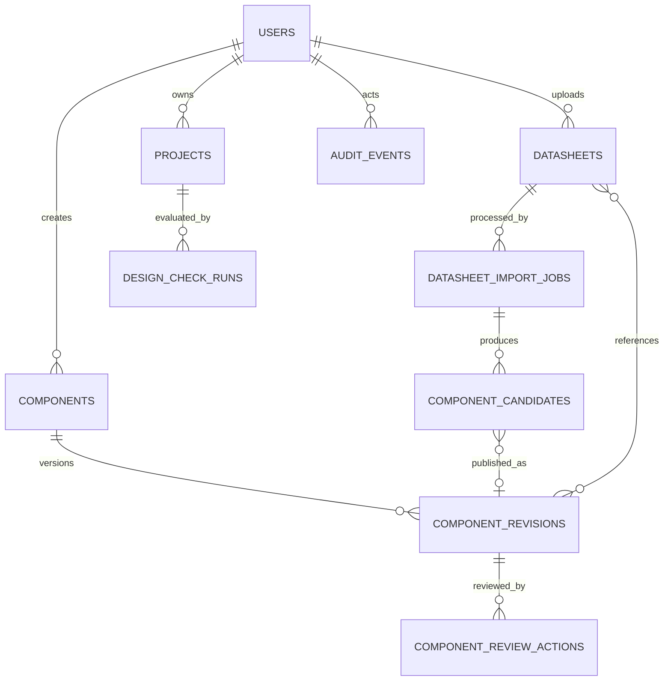

# Database Schema V1
## Hardware System Designer

**Document Version:** 1.0

**Status:** Baseline Specification

**Target Release:** V1

**Database Engine:** PostgreSQL 16+

**Canonical Migration:** `../../database/migrations/0001_initial_schema.sql`

**Related Specifications:** `component-schema-v1.md`, `connection-rule-specification-v1.md`, `project-file-specification-v1.md`

---

## 1. Purpose

This document defines the V1 relational persistence model for users, the global component library, datasheet processing, component review, projects, Design Check history, and audit events.

The database uses a hybrid model:

- Relational columns provide identity, ownership, lifecycle, concurrency, filtering, and referential integrity.
- Canonical Component Schema V1 and Project File Schema V1 documents are stored as JSONB without decomposing their engineering graphs into a second competing source of truth.
- Application services validate JSON Schema and semantic rules before writing.
- PostgreSQL constraints enforce critical envelope invariants even if an application validation path is bypassed.

---

## 2. Scope Boundary

Database Schema V1 includes:

- Users and `USER`/`ADMIN` roles.
- Datasheet metadata and object-storage references.
- AI extraction jobs and candidate documents.
- Global component identities and immutable revisions.
- Component-to-datasheet traceability.
- Admin review actions.
- Current canonical project documents with optimistic concurrency.
- Design Check run history.
- Append-only audit events.

It does not include:

- PDF binary storage inside PostgreSQL.
- Browser recovery cache.
- Sessions, OAuth tokens, password-reset tokens, or email delivery state.
- Search-engine indexes outside PostgreSQL.
- Queue implementation details.
- Analytics warehouse data.
- Full project revision history or collaborative editing operations.
- Schematic or PCB data.

Authentication session storage may be added by the selected authentication subsystem without changing the engineering tables in this specification.

---

## 3. Design Principles

1. Canonical engineering documents are validated before persistence.
2. Published component revisions are immutable.
3. Component lifecycle changes create a new revision.
4. Projects retain embedded component snapshots.
5. Autosave updates one current project document instead of inserting a complete history row every three seconds.
6. Project writes use compare-and-swap on `document_revision`.
7. Engineering and document revisions remain distinct.
8. Datasheet binaries remain in object storage and are referenced by opaque keys.
9. User-facing IDs use the prefixes defined by the V1 schemas.
10. Deletion is soft or restricted for engineering records needed by historical projects.
11. Database checks complement, but do not replace, JSON Schema and Rule Engine validation.
12. All timestamps use `TIMESTAMPTZ` and UTC at service boundaries.

---

## 4. High-Level Relationships



Project instances, connections, allocations, notes, and warning overrides are contained in `projects.document` according to Project File Schema V1. They are not duplicated into relational child tables in V1.

---

## 5. Identifier Strategy

Application services generate stable text IDs before insertion:

| Entity | Prefix |
|---|---|
| User | `USR-` |
| Datasheet | `DS-` |
| Import job | `IMPORT-` |
| Candidate | `CAND-` |
| Component | `CMP-` |
| Review action | `REVIEW-` |
| Project | `PROJ-` |
| Design Check run | `CHECK-` |

The database validates prefixes with `CHECK` constraints. IDs are opaque and shall not encode authorization, timestamps, manufacturer data, or sequence semantics.

Nested project-local IDs remain inside the canonical Project JSON document.

---

## 6. Users

`users` stores application principals.

Key fields:

- `user_id`.
- Case-insensitive unique email index.
- Display name.
- Password hash produced by the authentication service.
- Role: `USER` or `ADMIN`.
- Account status: `ACTIVE` or `DISABLED`.
- Creation, update, and optional last-login timestamps.

The database never stores plaintext passwords. Password hashing, login throttling, MFA, sessions, and credential rotation belong to the authentication service.

User rows are not hard-deleted while referenced. Disabling an account preserves ownership and audit history.

---

## 7. Datasheets

`datasheets` stores metadata for externally stored PDFs:

- Original filename.
- Constant media type `application/pdf`.
- Byte size from `1` through `10,485,760`.
- Page count from `1` through `100` when known.
- Unique SHA-256 digest.
- Opaque object-storage key.
- Uploading user and timestamp.
- Optional soft-deletion timestamp.

The object key is not interpreted as a local filesystem path. Download authorization is checked by the backend before issuing access.

Duplicate SHA-256 content reuses the existing datasheet row rather than storing another binary.

---

## 8. Datasheet Import Jobs and Candidates

### 8.1 Import Jobs

`datasheet_import_jobs` tracks asynchronous AI extraction:

- Requesting user and source datasheet.
- State: `QUEUED`, `PROCESSING`, `REVIEW_REQUIRED`, `COMPLETED`, or `FAILED`.
- Optional model identifier.
- Start and completion timestamps.
- Sanitized error code and error message.

The job record does not grant component verification.

### 8.2 Candidates

`component_candidates` stores one or more candidates per import job:

- Stable candidate ID and ordinal.
- Optional detected label.
- Candidate JSONB, which may be incomplete while under review.
- Optional overall confidence from `0` through `1`.
- State: `DETECTED`, `SELECTED`, `REJECTED`, or `PUBLISHED`.
- Optional reference to the published component revision.

Candidate JSON is not accepted as a Component Schema V1 document until publication validation succeeds.

---

## 9. Global Component Library

### 9.1 Component Identity

`components` represents a logical component across revisions. It stores:

- Stable `component_id`.
- Creator.
- Latest revision number.
- Searchable fields copied from the latest revision: canonical name, manufacturer, part number, category, abstraction, and lifecycle status.
- Creation and update timestamps.

The searchable fields are projections maintained by the revision insertion trigger. The immutable `component_revisions.definition` remains authoritative.

### 9.2 Component Revisions

`component_revisions` stores each complete canonical Component Schema V1 JSONB document with relational projection fields.

Primary key:

```text
(component_id, revision)
```

Database checks require:

- Exact schema version `hwsd.component/1`.
- JSON root object.
- JSON component ID and revision matching relational columns.
- JSON name, category, abstraction, lifecycle status, and revision notes matching projection columns.
- Valid lifecycle and verification metadata pairing.

A trigger locks the parent component and requires the next revision to equal `latest_revision + 1`. After insertion, it updates the current searchable projection.

Update and delete operations on component revisions are blocked. Corrections create another revision.

### 9.3 Datasheet References

`component_revision_datasheets` provides normalized traceability between revisions and datasheets. It shall agree with the datasheet references embedded in the component definition.

### 9.4 Review Actions

`component_review_actions` records actions such as submission, approval, rejection, requested revision, deprecation, and disabling. It supplements the revision document with an auditable workflow trail.

Review rows are append-only.

---

## 10. Projects

`projects` stores the current canonical Project File V1 JSONB document plus searchable and concurrency columns:

- Project ID and owner.
- Name and optional description.
- `document_revision`.
- `engineering_revision`.
- Exact schema and ruleset versions.
- Complete canonical `document` JSONB.
- Autosave settings and last successful save time.
- Creation, update, and optional soft-deletion timestamps.

Database checks require envelope values in JSON to match their relational projections, including project ID, revisions, owner, name, schema version, and ruleset version.

Project metadata columns are projections for listing and authorization. The complete JSON document is the portable engineering source of truth.

### 10.1 Project Write Transaction

A save transaction shall:

1. Validate Project File Schema V1 and all referenced schemas.
2. Run semantic cross-reference validation.
3. Run required Connection & Rule Engine validation.
4. Execute `save_project_v1` with the expected current revision and proposed document.
5. Update the row only when `document_revision` still matches.
6. Return a conflict without modifying data when another save has won.

The stored function requires the new document revision to be exactly `expected + 1` and reprojects metadata from the canonical JSON.

### 10.2 Deletion

Project deletion sets `deleted_at`. Hard deletion is a separate retention process and is not part of ordinary user actions.

---

## 11. Design Check Runs

`design_check_runs` is append-only history for explicit Design Check executions. Each row stores:

- Project and evaluated document/engineering revisions.
- Ruleset version.
- Complete Connection Rule Result V1 JSONB.
- User who initiated the check.
- Timestamp.

The result inside the portable project remains the current embedded result. The relational run table supports audit and diagnostics without becoming a second source for the project's current status.

The application shall write the project document and its corresponding Design Check history row in one transaction when both are changed by the same operation.

---

## 12. Audit Events

`audit_events` is an append-only log for important actions:

- Component creation and revision publication.
- Admin review and verification.
- Component deprecation and disabling.
- Project component update.
- Warning override.
- Datasheet replacement.
- Project import and deletion.

Events contain actor, entity type, entity ID, action, timestamp, and structured JSONB metadata. Sensitive credentials and full datasheet content shall never be placed in audit metadata.

Audit events support traceability but do not replace canonical entity state.

---

## 13. JSON Validation Boundary

PostgreSQL V1 enforces document envelope invariants with `CHECK` constraints. Full validation remains in application code because:

- JSON Schema Draft 2020-12 is not native PostgreSQL functionality.
- Cross-file `$ref` resolution is required.
- Semantic validation resolves component-local references and Rule Engine behavior.
- Keeping validation logic shared with import/export avoids database-only behavior differences.

Every write path, including administrative tools and background jobs, shall call the same validators before persistence.

Direct production table writes are restricted to the backend service role and migration role.

---

## 14. Transaction Boundaries

The following operations are atomic:

- Publish component revision, update latest projection, link datasheets, and write audit/review records.
- Save project with optimistic concurrency and write related audit event.
- Persist Design Check result in the project and append its run record.
- Publish a candidate and link it to the resulting component revision.

A failure rolls back the entire operation. No job shall mark itself `COMPLETED` before all publication writes commit.

---

## 15. Indexing Strategy

V1 indexes support:

- Case-insensitive user login by email.
- Current component listing by status/category/name.
- Component lookup by manufacturer and part number.
- JSONB search inside component definitions when structured columns are insufficient.
- Datasheet digest and object-key lookup.
- Import jobs by requesting user and status.
- Project listing by owner and recent update.
- Design Check history by project and time.
- Audit lookup by entity and time.

GIN indexes use `jsonb_path_ops` for containment queries. New workload-specific indexes require query evidence and migration review.

---

## 16. Concurrency

### 16.1 Component Publication

The revision trigger locks the logical component row. Concurrent attempts to publish the same next revision cannot both succeed.

### 16.2 Project Saving

Project updates use compare-and-swap:

```sql
WHERE project_id = :project_id
  AND owner_user_id = :owner_user_id
  AND document_revision = :expected_revision
```

Zero updated rows means conflict or unavailable project; the backend distinguishes authorization without leaking other users' project existence.

V1 supports one editor at a time but still guards against multiple tabs, retries, delayed autosaves, and network races.

---

## 17. Security

- Application connections use TLS in deployed environments.
- Database credentials are not stored in project or component documents.
- The service role receives only required table/function privileges.
- Migration privileges are separate from runtime privileges.
- Password hashes are never returned by ordinary user queries.
- Object-storage keys remain opaque and do not grant access by themselves.
- Admin role checks occur in the backend before verification/review writes.
- SQL parameters are always bound; document content is never interpolated into SQL.
- User text is treated as data and escaped by presentation layers.

Row-level security may be introduced later, but V1 authorization is enforced by the backend and owner-scoped queries. Enabling RLS requires dedicated policies and tests rather than assuming `owner_user_id` alone provides isolation.

---

## 18. Retention and Recovery

- Component revisions are retained indefinitely in V1 because project snapshots and review history may reference them.
- Datasheet metadata remains while referenced; binary cleanup requires reference checks and retention policy.
- Projects use soft deletion.
- Failed import jobs and rejected candidates may be removed by a configured maintenance policy after audit requirements are satisfied.
- Audit and Design Check retention is an operational policy, not an unbounded application query.

Backups shall include PostgreSQL data and separately managed object-storage content. Restore testing shall verify both stores and their references.

---

## 19. Migration Rules

The initial migration is forward-only and transactional.

Future migrations shall:

- Use monotonically ordered migration names.
- Avoid rewriting immutable historical definitions unless performing an explicit schema migration.
- Backfill before adding non-null constraints to populated tables.
- Preserve current Project and Component schema identifiers.
- Include rollback or recovery instructions for non-transactional operations.
- Be tested against a production-like copy with representative JSON document sizes.

The application shall refuse startup when required migrations are missing.

---

## 20. Required Tests

Database integration tests shall cover:

- User email uniqueness ignoring case.
- Datasheet size, page, MIME type, digest, and object-key constraints.
- Import job and candidate state values.
- Sequential component revision publication under concurrency.
- Component revision update/delete rejection.
- Component JSON/column mismatch rejection.
- Verified status metadata requirements.
- Current component projection after revision insertion.
- Project JSON/column mismatch rejection.
- Project save success and stale-revision conflict.
- `engineering_revision <= document_revision`.
- Soft-deleted project exclusion from active lists.
- Design Check result envelope validation.
- Append-only review, Design Check, and audit records.
- Transaction rollback for failed publication and project save flows.
- Foreign-key restriction for referenced users, components, and datasheets.
- Query plans for main library and project listing operations.

---

## 21. V1 Acceptance Criteria

Database Schema V1 is correctly implemented when:

1. All canonical component and project documents persist without information loss.
2. Published component revisions cannot be modified or removed.
3. Concurrent component publication cannot create duplicate revision numbers.
4. Concurrent project saves cannot silently overwrite newer work.
5. Global library listing and project listing use indexed relational projections.
6. Datasheet binaries remain outside PostgreSQL with durable traceability.
7. AI candidates remain distinguishable from published and verified components.
8. Admin review, Design Check, and important project actions are auditable.
9. Database envelope checks reject mismatched JSON and relational metadata.
10. The initial migration applies cleanly to an empty PostgreSQL 16 database.

