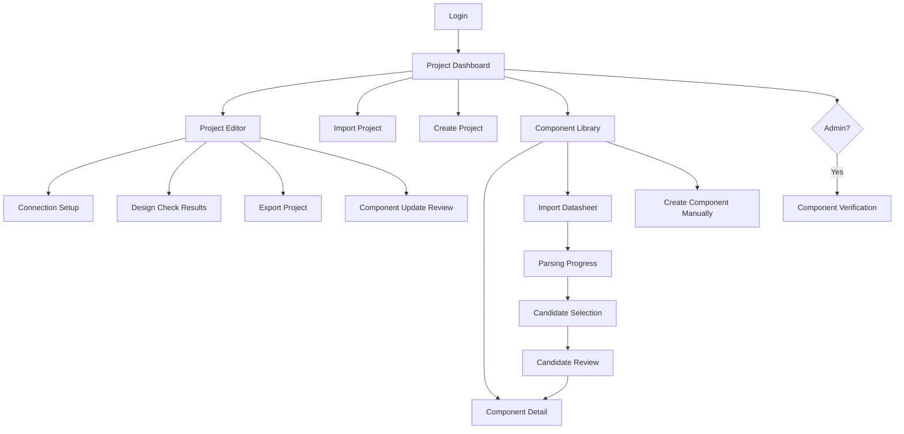
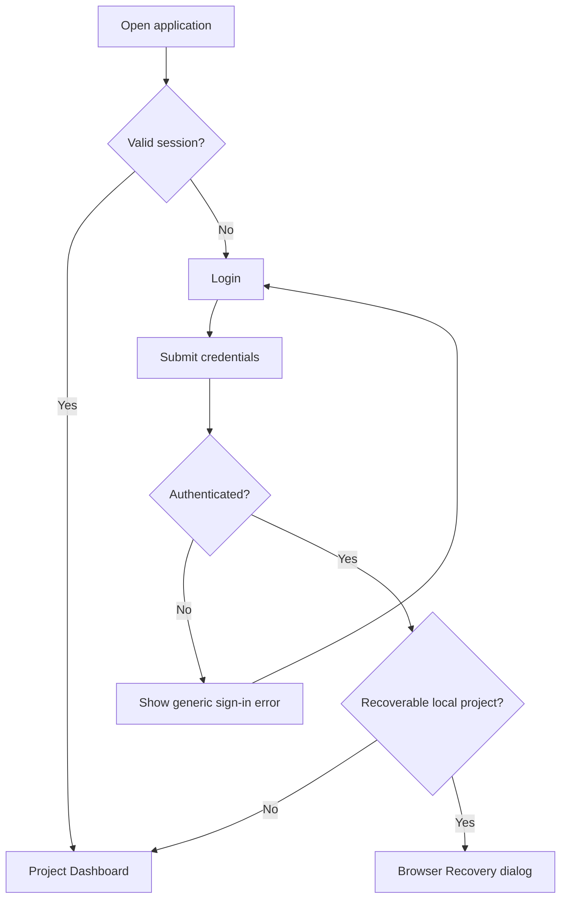
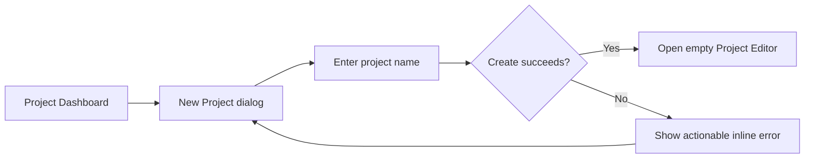
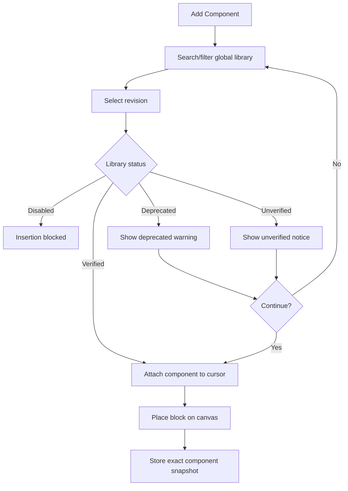
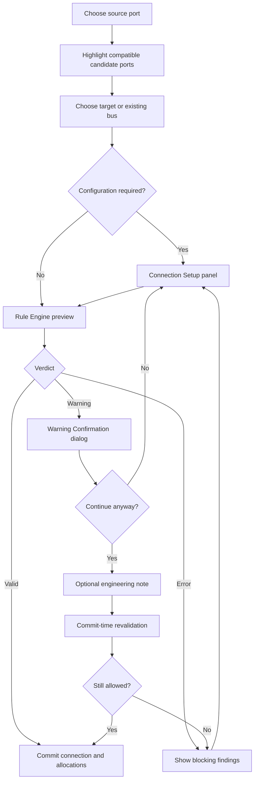
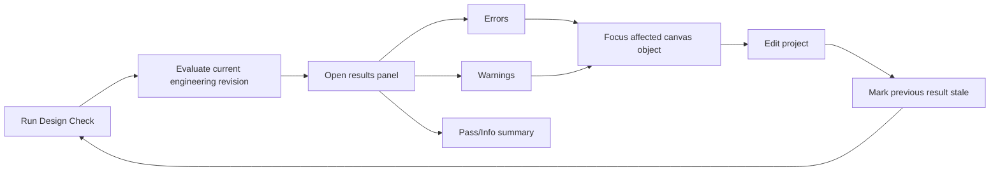
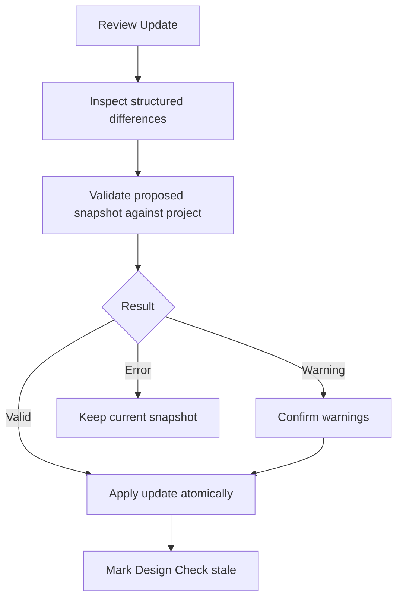

# UI/UX Screen Flow V1
## Hardware System Designer

**Document Version:** 1.0

**Status:** Baseline Screen Flow

**Target Release:** V1

**Application Type:** Desktop-first web application

**Related Specifications:** Engineering Specification V1, Component Schema V1, Port/Interface Schema V1, Connection & Rule Engine Specification V1, and Project File Specification V1

---

## 1. Purpose

This document defines the V1 screen inventory, navigation model, primary user journeys, validation interactions, state transitions, and recovery flows.

It describes what users see and where they go. Detailed visual styling, final spacing, typography, and production component measurements belong to the wireframe and design-system stages.

---

## 2. UX Principles

1. Engineering state is always visible and explainable.
2. Invalid actions are blocked before they corrupt project state.
3. Warnings require informed confirmation and remain auditable.
4. AI-extracted data is clearly separated from admin-verified data.
5. Project component snapshots never update silently.
6. Autosave status is visible without interrupting normal editing.
7. Errors use text and icons in addition to color.
8. Complex decisions disclose details progressively.
9. The canvas remains the primary workspace, not a decorative drawing surface.
10. Every destructive action has an explicit target and consequence.

---

## 3. Roles and Access

### 3.1 User

A User can access:

- Login.
- Project dashboard.
- Project editor.
- Global component library.
- Datasheet import and candidate review.
- Manual component creation.
- Component detail and revision history.
- Project import/export.

### 3.2 Admin

An Admin can access all User screens plus:

- Component review queue.
- Verification workspace.
- Reject/request-revision actions.
- Deprecate and disable actions.

Unauthorized routes redirect to the nearest permitted screen with a non-sensitive access message. The UI is not an authorization boundary; backend authorization remains mandatory.

---

## 4. Information Architecture



---

## 5. Screen Inventory

| ID | Screen | Suggested route | Access | Primary purpose |
|---|---|---|---|---|
| `AUTH-01` | Login | `/login` | Public | Authenticate an existing user. |
| `PROJ-01` | Project Dashboard | `/projects` | User/Admin | List, create, open, import, and delete projects. |
| `PROJ-02` | Import Project | Modal from `/projects` | User/Admin | Validate and import a local `.txt` project. |
| `EDIT-01` | Project Editor | `/projects/:projectId/editor` | Owner/Admin policy | Build and validate the hardware design. |
| `LIB-01` | Component Library | `/components` | User/Admin | Search and inspect global components. |
| `LIB-02` | Component Detail | `/components/:componentId/revisions/:revision` | User/Admin | Inspect engineering data and revision history. |
| `IMP-01` | Datasheet Upload | `/components/import` | User/Admin | Upload one PDF for AI extraction. |
| `IMP-02` | Parsing Progress | `/components/imports/:importId` | User/Admin | Track extraction state and failure recovery. |
| `IMP-03` | Candidate Selection | Same import route | User/Admin | Select one or more detected variants. |
| `IMP-04` | Candidate Review | `/components/imports/:importId/candidates/:candidateId` | User/Admin | Review and edit extracted data. |
| `COMP-01` | Manual Component Editor | `/components/new` | User/Admin | Create a component without AI extraction. |
| `ADMIN-01` | Review Queue | `/admin/component-reviews` | Admin | Prioritize pending component reviews. |
| `ADMIN-02` | Verification Workspace | `/admin/component-reviews/:componentId/:revision` | Admin | Compare evidence, correct, approve, or reject. |

The following overlays use stable IDs for wireframes and implementation tests:

| ID | Overlay | Host screen |
|---|---|---|
| `OVR-01` | New Project dialog | Project Dashboard |
| `OVR-02` | Delete Project confirmation | Project Dashboard |
| `OVR-03` | Add Component drawer | Project Editor |
| `OVR-04` | Connection Setup panel | Project Editor |
| `OVR-05` | Warning Confirmation dialog | Project Editor/import/update flows |
| `OVR-06` | Engineering Note editor | Project Editor |
| `OVR-07` | Design Check results panel | Project Editor |
| `OVR-08` | Component Update Review dialog | Project Editor |
| `OVR-09` | Save Conflict dialog | Project Editor |
| `OVR-10` | Browser Recovery dialog | Login/Project Editor |
| `OVR-11` | Export dialog | Project Dashboard/Editor |
| `OVR-12` | Project Settings dialog | Project Editor |

Project Settings contains the autosave enablement and interval controls. Changes use the normal project save and recovery behavior.

---

## 6. Global Application Shell

Authenticated screens share:

- Product name/home link.
- Primary navigation: Projects, Component Library, and Admin Review when permitted.
- Current-user menu with role label and sign-out.
- Global notification region for asynchronous completion or failure.

Navigation rules:

- Leaving a clean screen navigates immediately.
- Leaving a locally dirty project requests an autosave attempt first.
- If save succeeds, navigation continues.
- If save fails, the user chooses to stay, retry, or leave while preserving browser recovery data.
- Session expiry never discards the local recovery copy.

---

## 7. Login Flow

`AUTH-01` contains:

- Email field.
- Password field with show/hide control.
- Sign-in action.
- Inline validation summary.



The error message shall not reveal whether an email address exists. After session expiry inside the editor, successful re-authentication returns the user to the same project when access remains valid.

Registration, password reset, and MFA setup are not defined by the Engineering Specification V1 and are not added to this flow.

---

## 8. Project Dashboard

`PROJ-01` is the authenticated landing screen.

### 8.1 Primary Content

- Page title and `New Project` action.
- `Import .txt` action.
- Search by project name.
- Project list ordered by most recent update.
- Project cards/rows with name, last update, save state, and latest Design Check summary when current.
- Empty state with create/import actions.

### 8.2 Project Actions

- Open.
- Rename.
- Export.
- Delete.

Delete requires a confirmation dialog showing the exact project name and explaining that V1 performs a soft deletion. The default focused action is Cancel.

### 8.3 New Project



The newly created project uses the default 3-second autosave interval and opens with an empty canvas and Add Component guidance.

---

## 9. Project Import Flow

`PROJ-02` is a staged modal or dedicated narrow workflow.

### 9.1 Steps

1. Choose one `.txt` file.
2. Display filename and size before upload.
3. Parse and validate schema/version.
4. Validate references and allocations.
5. Re-run the supported Rule Engine ruleset.
6. Present import summary.
7. Confirm `Create Copy`.

### 9.2 Outcomes

- **Valid:** show project name, component count, connection count, warnings, and Create Copy action.
- **Engineering incomplete:** allow import when structurally consistent; show that Design Check will contain errors such as missing required connections.
- **Unsupported future version:** block and identify the unsupported schema version.
- **Corrupt or inconsistent:** block with grouped validation issues; never partially create a project.
- **Warning confirmation needed:** explain each warning before import completion and store accepted overrides where required.

The imported copy receives a new project ID and ownership. The source file remains unchanged.

---

## 10. Project Editor Layout

`EDIT-01` uses five stable regions:

```text
┌──────────────────────────────────────────────────────────────────┐
│ Project bar: name · save state · undo/redo · Design Check · ⋯   │
├───────────────┬───────────────────────────────┬──────────────────┤
│ Library       │                               │ Inspector        │
│ and tools     │            Canvas             │ Properties       │
│               │                               │ Allocations      │
│               │                               │ Notes            │
├───────────────┴───────────────────────────────┴──────────────────┤
│ Issues / Design Check panel · status bar · zoom                 │
└──────────────────────────────────────────────────────────────────┘
```

### 10.1 Project Bar

- Back to Projects.
- Editable project name.
- Save state: `Saved`, `Saving…`, `Offline changes`, `Save failed`, or `Conflict`.
- Undo and redo.
- `Run Design Check` primary engineering action.
- Export and project settings menu.

### 10.2 Left Panel

Tabs:

- Components.
- Project outline.

Component search supports name, manufacturer, part number, category, abstraction, and verification status. Filters remain visible while searching.

### 10.3 Canvas

- Drag and drop.
- Move and permitted resize.
- Select and multi-select.
- Delete, copy, and paste.
- Zoom, pan, and snap to grid.
- Create and delete connections.

### 10.4 Right Inspector

Context changes with selection:

- Project properties when nothing is selected.
- Component snapshot, ports, pins, resources, power, addresses, status, and notes for a block.
- Endpoint and protocol settings for a connection.
- Multi-selection summary for multiple blocks.

### 10.5 Bottom Panel

Tabs:

- Issues.
- Design Check.
- Resource usage.

Selecting a finding focuses the relevant component, connection, port, or allocation on the canvas and opens its inspector context.

---

## 11. Component Block States

The canvas derives block state from current engineering data:

- Black border: no required ports satisfied.
- Blue border: some but not all required ports satisfied.
- Green, slightly thicker border: all required ports satisfied and no blocking error.
- Warning icon: one or more warning findings.
- Error icon: one or more blocking findings.
- Verified or Unverified badge.
- Deprecated badge where applicable.

Color is never the only differentiator. Border state includes accessible text in the inspector and tooltip.

Hover behavior scales the block visually by approximately 2–4% without changing stored dimensions or moving surrounding blocks.

Valid power connections use a red, slightly thicker line. Error presentation uses a separate icon/pattern so it cannot be confused with a normal power line.

---

## 12. Add Component Flow

Users can add a component from the editor drawer or open the full library.



The revision selector defaults to the latest permitted revision. The user may inspect revision history before insertion. A disabled component remains visible for historical understanding but its insert action is unavailable.

---

## 13. Component Library

`LIB-01` supports:

- Search.
- Category and abstraction filters.
- Verification/lifecycle filters.
- Manufacturer filter.
- Sort by name, recent update, or verification state.
- `Import Datasheet` and `Create Manually` actions.

Each result shows:

- Name and part number.
- Manufacturer.
- Category and abstraction.
- Latest revision.
- Lifecycle badge.
- Datasheet presence.

`LIB-02` displays:

- Identity and classification.
- Power characteristics.
- Ports and interfaces.
- Pins and alternate functions.
- Peripheral resources and mappings.
- Address capabilities.
- Datasheet references and extraction evidence.
- Revision timeline.
- Verification status and review notes allowed by role.

Opening component details from the editor preserves the current project context and returns to the Add Component flow.

---

## 14. Datasheet Import Flow

### 14.1 Upload

`IMP-01` accepts one PDF at a time.

Before upload, the UI states:

- PDF only.
- Maximum 10 MB.
- Maximum 100 pages.

Invalid type or size is rejected before AI processing. Page count failure is shown as soon as it is known.

### 14.2 Processing

`IMP-02` displays stable stages:

1. Uploading.
2. Validating PDF.
3. Extracting text/data.
4. Detecting candidates.
5. Preparing review.

Users may leave the screen. Completion/failure appears in the global notification region and import history.

Failure presents Retry when safe and Replace File when the input is the problem. Raw internal model errors are not exposed.

### 14.3 Candidate Selection

`IMP-03` shows every detected candidate with:

- Candidate name/part number.
- Variant/family.
- Suggested category and abstraction.
- Overall confidence summary.
- Selection checkbox.

At least one candidate must be selected to continue. Each selected candidate enters its own review flow.

### 14.4 Candidate Review

`IMP-04` is a stepper:

1. Identity and classification.
2. Power.
3. Pins and alternate functions.
4. Ports and interfaces.
5. Resources and mappings.
6. Addresses and protocols.
7. Evidence, confidence, and notes.
8. Validation summary and submission.

Low-confidence fields are visually marked and filterable. Selecting a field shows its datasheet page/evidence where available. Users can edit, add, or remove extracted values.

Submission is blocked until Component Schema validation and semantic validation pass. Successful submission produces a new global library revision with the appropriate non-verified lifecycle status.

---

## 15. Manual Component Creation

`COMP-01` reuses the Candidate Review editor without AI evidence.

The user supplies:

- Identity and classification.
- Pins.
- Ports and interfaces.
- Power data.
- Resources and compatible mappings.
- Address capabilities.
- Notes.

The editor starts with empty valid collections rather than invented values. Unknown fields remain omitted. A manually created component remains unverified until admin approval.

---

## 16. Connection Creation Flow

The user starts by dragging from a visible port or choosing `Connect` from the block inspector.



Candidate highlighting is guidance only. Final validity always comes from Rule Engine preview and commit-time revalidation.

### 16.1 Connection Setup Panel

The panel may request:

- Compatible pin mapping.
- Peripheral/controller selection.
- Channel selection.
- Existing bus or new bus.
- Device address.
- Operating frequency.
- Serial settings.

Unavailable or conflicting options remain visible when useful, with a reason, rather than disappearing without explanation.

### 16.2 Valid Result

- Show a short valid summary.
- Commit connection and allocation effects atomically.
- Update resource counters and completeness state.
- Announce completion accessibly.

### 16.3 Warning Result

The Warning Confirmation dialog shows:

- Human-readable warning.
- Stable finding code/rule reference in details.
- Affected endpoints.
- Evidence values.
- Suggested actions.
- `Go Back` and `Continue Anyway` actions.
- Optional engineering note.

Continue is never the default focused action. Confirmation stores the warning override fingerprint.

### 16.4 Error Result

- Do not create the connection or partial allocations.
- Keep the setup context so the user can choose other pins, ports, or settings.
- Focus the first blocking issue while retaining the complete finding list.
- Offer converter/transceiver category suggestions when provided by the rule.

---

## 17. Bus Connection Flow

When a selected port supports `SHARED_BUS` or `MULTI_DROP`, the setup panel offers:

- Join a compatible existing bus.
- Create a new bus.

### 17.1 I2C

- Show controller and current targets.
- Show controller allocation as used once.
- Request/select target address when configurable.
- Detect fixed or selected address conflicts before commit.
- Show bus voltage and maximum common frequency.

### 17.2 SPI

- Show shared SCLK/MOSI/MISO mapping.
- Request a unique chip-select pin per target.
- Display controller allocation once and CS allocation per target.

### 17.3 RS-485 and Modbus RTU

- Show all bus nodes.
- Reject UART TTL endpoints unless an intermediate transceiver is present.
- Request a slave address from `1` through `247` for Modbus targets.

### 17.4 CAN

- Show peer nodes.
- Identify missing physical transceiver through rule findings.
- Do not claim termination correctness in V1.

---

## 18. Power Connection Flow

Power connection setup shows:

- Source voltage range and maximum current.
- Destination accepted voltage range.
- Existing loads on the same power net.
- Conservative total current after the candidate load.
- Remaining capacity and margin.

Outcomes:

- Voltage or polarity incompatibility: blocking error.
- Current capacity exceeded: blocking error.
- Margin below 20%: warning confirmation.
- Missing power data: incomplete-validation warning.
- Valid: commit with visually distinct power line.

Ground is explained as implied and is not offered as a separate V1 drawable connection.

---

## 19. Resource Usage

The selected MCU/component inspector and bottom Resource Usage tab show:

```text
UART   1 used / 1
SPI    0 used / 1
I2C    1 used / 2
ADC    2 used / 8
```

The UI distinguishes:

- Controller allocation.
- Channel allocation.
- Pin allocation.
- Shared-bus device count.

Selecting a used resource highlights every connection consuming or sharing it. Fully allocated resources may display an informational finding.

---

## 20. Design Check Flow

`Run Design Check` is always reachable from the project bar.



The results header shows:

- Evaluated engineering revision.
- Pass, info, warning, and error counts.
- Current or stale state.

Findings can be grouped by severity or category and filtered by component. Acknowledged warnings remain visible with an `Acknowledged` label.

After a rule-relevant edit, the result becomes stale immediately. The UI may run incremental checks for guidance but shall not relabel the previous full result as current.

---

## 21. Engineering Notes

Notes can be created from:

- Project inspector.
- Component inspector.
- Connection inspector.
- Allocation/resource detail.
- Warning Confirmation dialog.

The note editor shows its scope and target explicitly. Notes are plain text. Removing a target asks whether to delete its attached notes or cancel the target deletion; V1 does not silently orphan them.

---

## 22. Component Update Flow

When a newer library revision exists, the instance inspector shows `Update Available` and `Review Update`.

The update dialog compares:

- Current and proposed revisions.
- Added, removed, and changed ports.
- Pin and mapping changes.
- Resource changes.
- Electrical limit changes.
- Lifecycle and verification changes.



The update never occurs automatically. A blocking result leaves the existing snapshot and connections unchanged.

---

## 23. Export Flow

From the project menu:

1. Ensure the latest local change has been saved or clearly identify the exported local state.
2. Validate the Project File V1 document.
3. Generate UTF-8 JSON with `.txt` extension.
4. Download using a sanitized project-name filename.

The export dialog states that datasheet PDFs and credentials are not embedded. Export remains available when the latest Design Check contains warnings or errors, because it is a preservation action rather than an approval action.

---

## 24. Autosave and Save Status

Save states are:

- `Saved`.
- `Unsaved changes`.
- `Saving…`.
- `Offline changes`.
- `Save failed`.
- `Conflict`.

Normal autosave does not use success toasts every three seconds. Status changes appear in the project bar without stealing focus.

On failure:

- Preserve changes in browser recovery storage.
- Show Retry.
- Continue marking new local edits as dirty.
- Never imply the server contains unsaved changes.

---

## 25. Browser Recovery Flow

Recovery is offered when a local cached document is newer or divergent from the server state.

The dialog compares:

- Project name.
- Server and recovery timestamps.
- Document revisions.
- A summary of local changes when available.

Actions:

- `Open Recovery Copy`.
- `Use Server Version`.
- `Download Recovery Copy`.
- Cancel and return to Projects.

Opening recovery does not immediately overwrite the server. The recovered state is validated and then saved through normal concurrency checks.

---

## 26. Save Conflict Flow

A conflict occurs when the expected document revision no longer matches the server.

V1 does not attempt automatic multi-user merge.

The conflict dialog provides:

- `Reload Server Version` after offering a recovery download of local work.
- `Download Local Copy`.
- `Cancel` and remain in read-only/conflict state.

The editor blocks further server saves until the conflict is resolved. Local recovery continues.

---

## 27. Admin Review Queue

`ADMIN-01` lists revisions with:

- Component identity.
- Submitter.
- Submission time.
- Current lifecycle status.
- Datasheet presence.
- Low-confidence field count.
- Review priority/filter state.

Filters include pending verification, review required, submitter, category, and age.

Opening a row enters `ADMIN-02`.

---

## 28. Verification Workspace

`ADMIN-02` uses a review layout:

- Component fields and validation issues.
- Datasheet/evidence viewer.
- Field confidence and source references.
- Revision history.
- Review note area.

Actions:

- Approve and create a `VERIFIED` revision.
- Correct and create a revised definition.
- Request revision.
- Reject.
- Deprecate.
- Disable.

Every action has a confirmation summary. Deprecate and Disable explain their different effects. The original published revision is not edited in place.

---

## 29. Loading, Empty, and Error States

Every top-level screen defines:

- Initial loading state.
- Empty state with a relevant next action.
- Recoverable error with Retry.
- Permission-denied state without sensitive details.
- Not-found state.

Long operations preserve context and use progress labels. Skeletons may be used for list loading; engineering values shall not display fake placeholder numbers.

If component or project data fails schema validation, the UI presents a safe diagnostic state and does not render it as trustworthy engineering content.

---

## 30. Keyboard and Accessibility Flow

Minimum V1 behavior:

- Logical tab order across shell, panels, canvas controls, and dialogs.
- Visible keyboard focus.
- Escape closes non-destructive overlays when safe.
- Enter does not activate `Continue Anyway` unless that action has explicit focus.
- Canvas objects are reachable through the Project Outline as a non-pointer alternative.
- Findings link to accessible object names and ports.
- Icons have text alternatives.
- Status is never communicated by color alone.
- Dialog focus is trapped and returns to the invoking control.
- Changes to save state and validation result use non-disruptive live-region announcements.

Suggested editor shortcuts are documented in-product and avoid browser-reserved combinations. Delete, copy, paste, undo, redo, zoom, and selection actions require keyboard equivalents.

---

## 31. Responsive Behavior

The Project Dashboard, library, import, review, and admin screens adapt to narrower viewports.

The engineering editor is desktop-first because it requires simultaneous canvas, port, allocation, and validation context. On insufficient width:

- Side panels become drawers.
- The issues panel becomes a full-width sheet.
- Core data remains readable.
- The application does not silently remove engineering controls.

If the viewport cannot support safe editing, V1 may provide read-only inspection with a clear “larger screen required for editing” message. Project data remains accessible for export and recovery.

---

## 32. Terminology and Message Rules

Use consistent terms:

- Component, not generic “item.”
- Port, Pin, Resource, Channel, and Interface according to their schemas.
- Verified means admin-verified only.
- Warning means the action may proceed after confirmation.
- Error means the action is blocked.
- Snapshot means the exact component revision stored in a project.
- Design Check means full deterministic project evaluation.

Messages lead with the engineering consequence and then the remedy.

Example:

```text
UART TTL cannot connect directly to RS-485.
Insert an RS-485 transceiver between these endpoints.
```

Do not use vague text such as “Something went wrong” when a safe actionable cause is known.

---

## 33. Screen Flow Acceptance Criteria

The V1 screen flow is complete when a user can:

1. Sign in and reach the project dashboard.
2. Create, open, rename, import, export, and soft-delete a project.
3. Recover unsaved browser state without silently overwriting the server.
4. Search the global component library and inspect revision details.
5. Import a valid PDF and review multiple detected candidates.
6. Create a component manually.
7. Insert an exact component revision into a project.
8. Build point-to-point, bus, and power connections.
9. Select compatible pins, resources, mappings, channels, and addresses.
10. Understand and act on valid, warning, and error outcomes.
11. Confirm a warning with optional engineering rationale.
12. View peripheral and pin usage.
13. Add scoped engineering notes.
14. Run Design Check and navigate from findings to affected objects.
15. Review and explicitly apply a newer component revision.
16. See reliable autosave, offline, failure, and conflict states.
17. Complete admin verification when authorized.
18. Operate critical flows without relying exclusively on pointer input or color.
